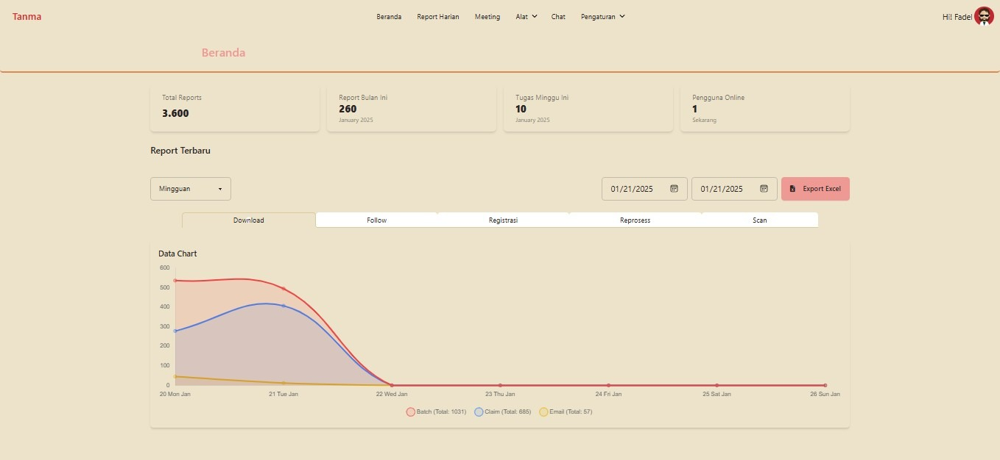
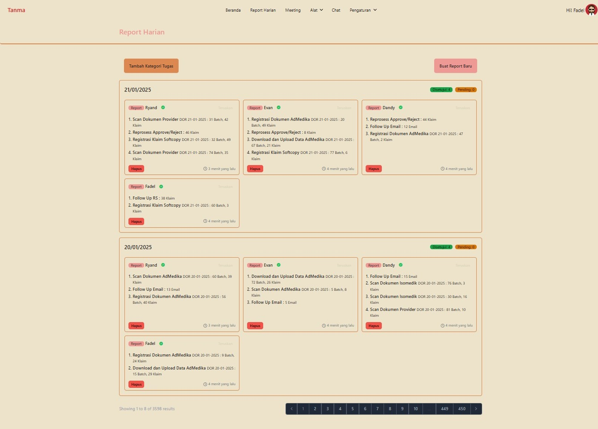
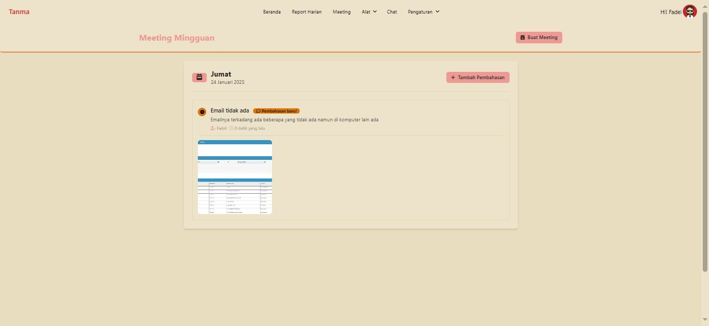
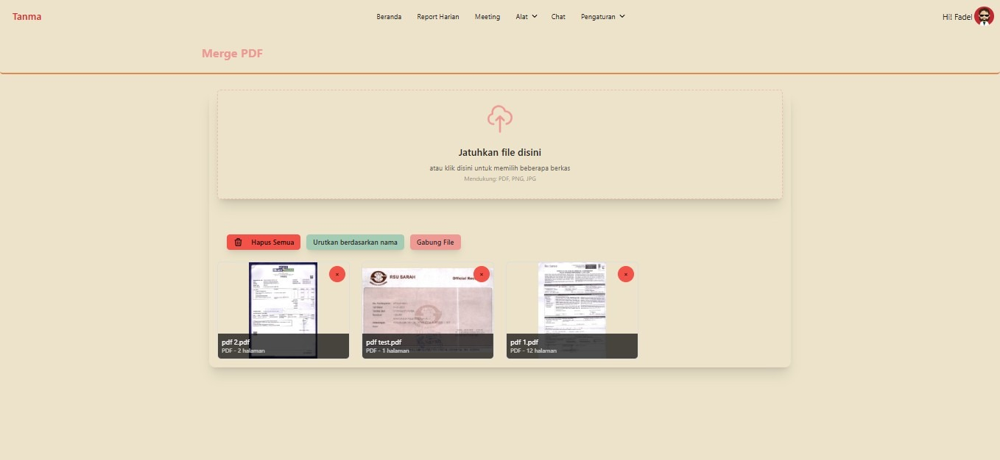
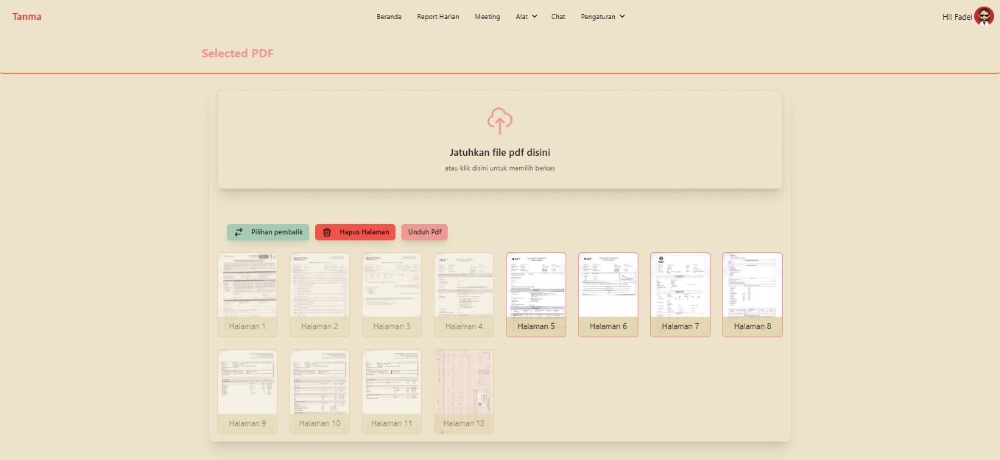
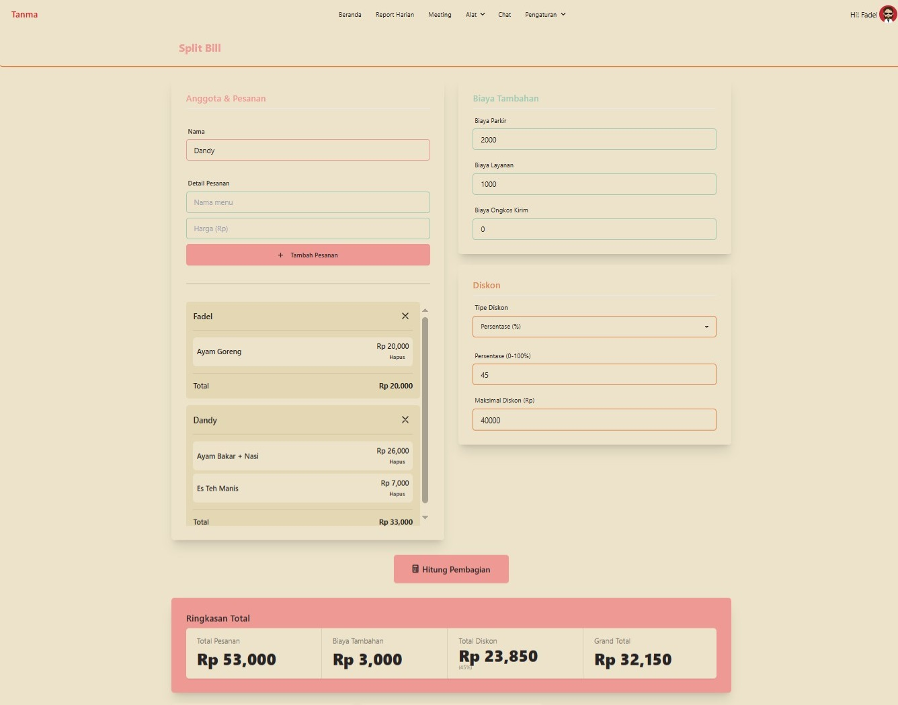
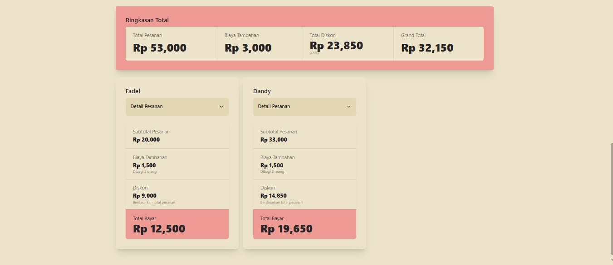
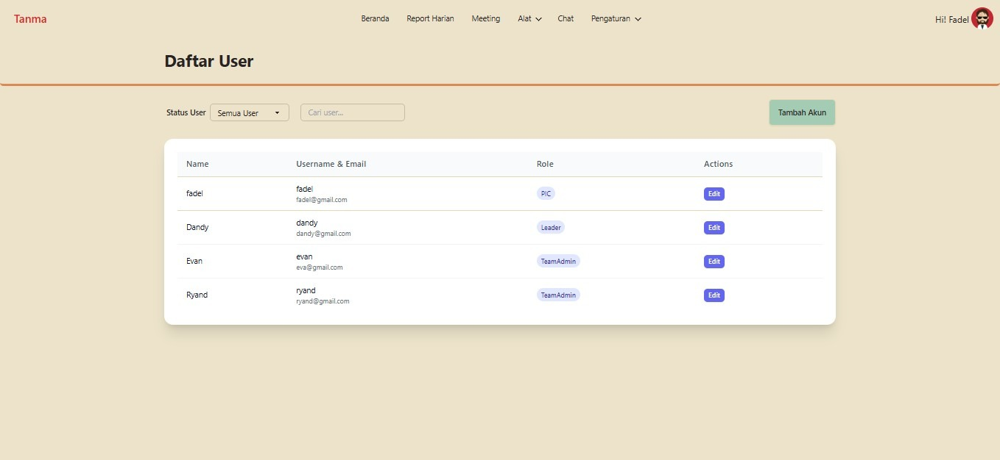
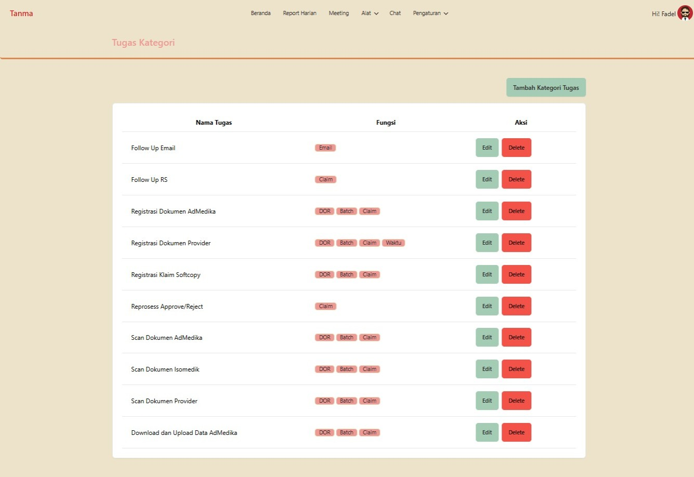

    

<h1 align="center">TANMA - Report System</h1>

TANMA adalah project kampus untuk tugas besar matakuliah pengembangan perangkat lunak. yang berisikan informasi report harian kerja serta alat-alat penunjang kerja.

## Fitur

 - Dashboard
 - Report Harian, Kategori Report
 - Tools (PDFmerge, PDFselected, SplitBill)
 - User Management

## Screenshots

## Teknologi

Backend Framework & Language:

**Laravel 11**

Database: **MySQL**

**Frontend Technologies:**

- Blade Template Engine
- JavaScript
- SweetAlert2 (Library untuk modal/popup)
- Font Awesome (Icon library)
- Tailwind CSS (Utility-first CSS framework)
- DaisyUI (Tailwind CSS component library)

**Development Tools & Libraries:**
- Composer (PHP package manager)
- NPM (Node package manager)
- PHPSpreadsheet (untuk export Excel)
- Security & Authentication:

**Laravel Built-in Authentication**
- CSRF Protection
- Role-Based Access Control
- Breeze

